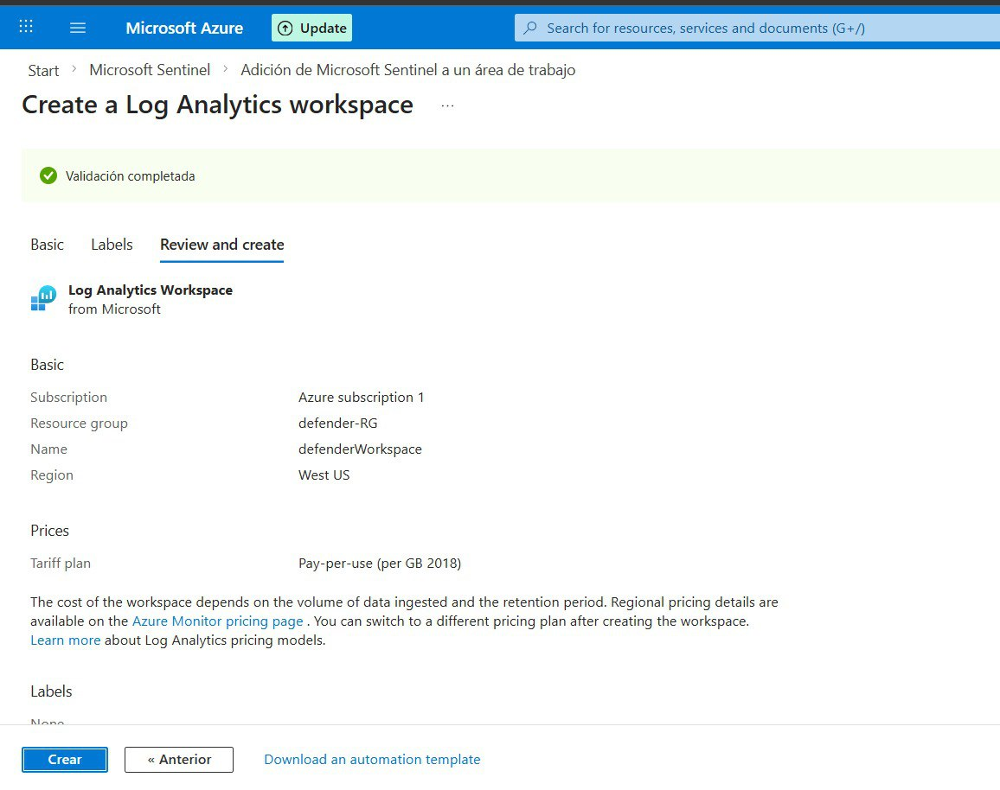

# SC-200T00A – Learning Path 7  
## Lab 1 – Exercise 1  
### Task 1 – Create a Log Analytics Workspace

---

## Objetivo

Crear un **Log Analytics Workspace** en Microsoft Azure para habilitar y configurar Microsoft Sentinel.

---

##  Entorno

- **Plataforma:** Microsoft Azure  
- **Servicio:** Log Analytics Workspace  
- **Resource Group:** Defender-RG  
- **Nombre del Workspace:** defenderWorkspace  
- **Región:** West US (predeterminada)

---

## Paso 2 – Acceder al Portal de Azure

1. Abrir **Microsoft Edge**.
2. Navegar a la siguiente URL:  
   https://portal.azure.com
3. Iniciar sesión con las credenciales del tenant proporcionadas por el laboratorio.

---

## Paso 3 – Navegar a Microsoft Sentinel

1. En la barra de búsqueda del portal de Azure, escribir:

2. Seleccionar **Microsoft Sentinel** en los resultados.

---

## Paso 4 – Crear un Nuevo Log Analytics Workspace

1. Seleccionar **+ Create**.
2. Hacer clic en **Create a new workspace**.

---

## Paso 5 – Configurar el Workspace

### Project Details

- **Subscription:** Azure subscription 1  
- **Resource Group:**
- Hacer clic en **Create new**
- Escribir: `Defender-RG`
- Seleccionar **OK**

### Instance Details

- **Name:** `defenderWorkspace`
- **Region:** West US (región predeterminada)

---

## Paso 6 – Validar y Desplegar

1. Seleccionar **Review + create**.
2. Esperar a que la validación sea exitosa.
3. Hacer clic en **Create**.
4. Esperar hasta que el estado del despliegue muestre **Created**.

---

## ✔ Resultado Esperado

El Log Analytics Workspace debe quedar desplegado con la siguiente configuración:

| Configuración     | Valor              |
|------------------|-------------------|
| Resource Group   | Defender-RG       |
| Workspace Name   | defenderWorkspace |
| Región           | West US           |
| Estado           | Created           |

---

## Resultado Final

El Log Analytics Workspace queda correctamente creado y listo para la implementación de Microsoft Sentinel.

---
