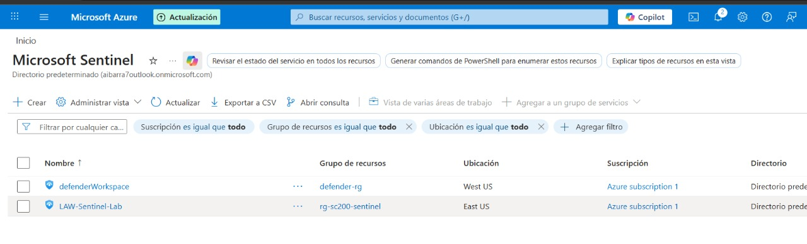

## Task 2 – Deploy Microsoft Sentinel to a Workspace

---

## 📌 Objetivo

Implementar **Microsoft Sentinel** sobre el Log Analytics Workspace creado en el Task 1 para habilitar capacidades SIEM y SOAR.

---

## 🏗 Prerrequisito

- Log Analytics Workspace previamente creado:
  - **Nombre:** defenderWorkspace
  - **Resource Group:** Defender-RG
  - **Estado:** Created

---

## 🏠 Paso 1 – Regresar al Inicio del Portal

1. Una vez finalizada la implementación del workspace, seleccionar **Home** desde el menú de navegación superior (breadcrumb) del portal de Azure.

---

## 🔎 Paso 2 – Acceder a Microsoft Sentinel

1. En la sección **Azure services**, localizar el ícono de **Microsoft Sentinel**.
2. Seleccionarlo para ingresar al servicio.

> Alternativamente, puede buscar "Microsoft Sentinel" en la barra superior de búsqueda.

---

## ➕ Paso 3 – Agregar Sentinel al Workspace

1. Seleccionar **+ Create**.
2. Se mostrará la lista de Log Analytics Workspaces disponibles.
3. Seleccionar el workspace:

4. Hacer clic en **Add**.

---

## ⏳ Paso 4 – Esperar la Implementación

1. Esperar unos minutos mientras se completa el proceso de habilitación.
2. Una vez finalizado, el workspace aparecerá como activo dentro de Microsoft Sentinel.

---

## ✔ Resultado Esperado

Microsoft Sentinel debe quedar correctamente habilitado sobre el workspace:

| Configuración            | Valor               |
|--------------------------|--------------------|
| Workspace               | defenderWorkspace  |
| Estado                  | Enabled / Active   |
| Servicio                | Microsoft Sentinel |

---

## 🎯 Resultado Final

Microsoft Sentinel queda desplegado sobre el Log Analytics Workspace, permitiendo comenzar la configuración de fuentes de datos, reglas analíticas, watchlists y gestión de amenazas.

---
