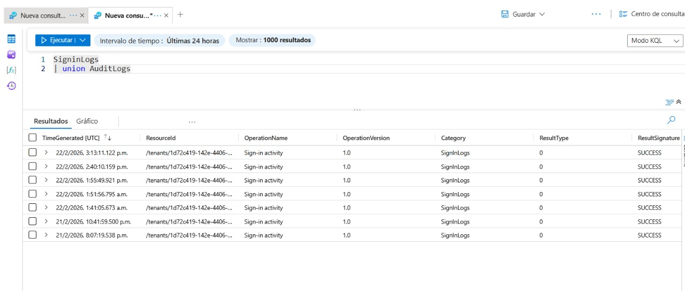
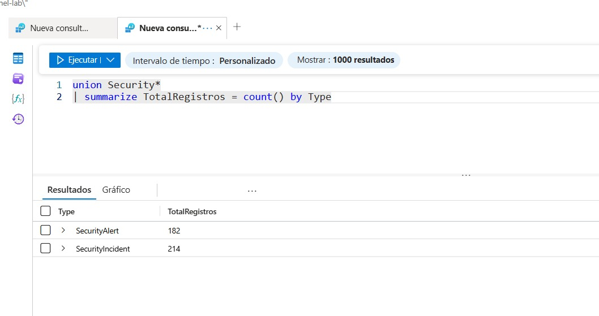

# Task 6 – Construcción de Consultas Multi-Tabla en KQL

## Objetivo
Aprender a combinar múltiples tablas utilizando los operadores `union` y `join` en KQL dentro de Microsoft Sentinel.

---

## Entorno de Trabajo

- **Plataforma:** Microsoft Azure / Microsoft Sentinel
- **Workspace:** law-sentinel-lab
- **Tablas utilizadas:**  
  - `SigninLogs` (registros de inicio de sesión)  
  - `AuditLogs` (registros de auditoría)  
  - `SecurityAlert` (alertas de seguridad)  
  - `SecurityIncident` (incidentes)

---

## 6.1 Uso del Operador UNION

El operador `union` permite combinar los registros de dos o más tablas en un único conjunto de resultados.

---

### Query 1 – Unir dos tablas completas

```kql
SigninLogs
| union AuditLogs
```

**Descripción:**  
Devuelve todas las filas de `SigninLogs` y `AuditLogs`. Permite analizar eventos de autenticación y auditoría en un solo resultado.



---

### Query 2 – Contar todos los registros combinados

```kql
SigninLogs
| union AuditLogs
| summarize TotalRegistros = count()
```

**Descripción:**  
Une ambas tablas y cuenta el número total de registros combinados, devolviendo una sola fila con el total.


---

### Query 3 – Unir una tabla completa con un resumen de otra

```kql
SigninLogs
| union (
    AuditLogs
    | summarize TotalAudit = count()
    | project TotalAudit
)
```

**Descripción:**  
Devuelve todas las filas de `SigninLogs` y agrega una fila adicional con el total de registros de `AuditLogs`. La fila adicional aparecerá con valores vacíos excepto en la columna resumida.


---

### Query 4 – UNION con comodín (Wildcard)

```kql
union Security*
| summarize TotalRegistros = count() by Type
```

**Descripción:**  
Une todas las tablas que comienzan con "Security" (en tu entorno: `SecurityAlert` y `SecurityIncident`). Luego agrupa el total de registros por el nombre de la tabla (`Type`).



---

## 6.2 Uso del Operador JOIN

El operador `join` combina registros de dos tablas basándose en una columna común, permitiendo relaciones entre datos.

---

### Query 5 – Join entre SigninLogs y SecurityAlert

```kql
SigninLogs
| summarize IntentosInicio = count() by UserPrincipalName
| join kind=inner (
    SecurityAlert
    | summarize TotalAlertas = count() by CompromisedEntity
) on $left.UserPrincipalName == $right.CompromisedEntity
```

**Descripción:**  
- Cuenta los inicios de sesión por usuario (`SigninLogs`).  
- Cuenta las alertas por entidad comprometida (`SecurityAlert`).  
- Une ambas tablas cuando el nombre de usuario coincide con la entidad comprometida.

**Nota:**  
- La primera tabla es la **Left table**.  
- La tabla dentro del `join` es la **Right table**.  
- Se usa `$left.UserPrincipalName` y `$right.CompromisedEntity` para referenciar columnas de cada lado.

---

## Tipos de JOIN soportados en KQL

- `inner` – Solo filas que coinciden en ambas tablas.
- `leftouter` – Todas las filas de la izquierda y las coincidentes de la derecha.
- `rightouter` – Todas las filas de la derecha y las coincidentes de la izquierda.
- `fullouter` – Todas las filas de ambas tablas.
- `leftanti` – Filas de la izquierda que no tienen correspondencia en la derecha.
- `rightanti` – Filas de la derecha que no tienen correspondencia en la izquierda.
- `leftsemi` – Filas de la izquierda que tienen correspondencia en la derecha (solo muestra columnas izquierdas).
- `rightsemi` – Filas de la derecha que tienen correspondencia en la izquierda (solo muestra columnas derechas).
- `innerunique` – Similar a inner, pero elimina duplicados de la izquierda.

---

## Notas importantes

- Si algunas consultas no devuelven resultados, puede deberse a que:
  - No existen alertas o incidentes en el entorno.
  - No hay coincidencias entre los valores de las columnas utilizadas para el join.
  - El laboratorio tiene poca actividad registrada.

- Para verificar la disponibilidad de datos, se puede ejecutar una consulta simple como:
  ```kql
  SecurityAlert
  | take 10
  ```

---

## Conclusión

En este taller se ha practicado el uso de los operadores `union` y `join` para combinar datos de múltiples tablas en Microsoft Sentinel. Estas técnicas son fundamentales para realizar análisis correlacionales entre diferentes fuentes de datos, enriquecer la información de seguridad y construir consultas complejas para la detección de amenazas.

