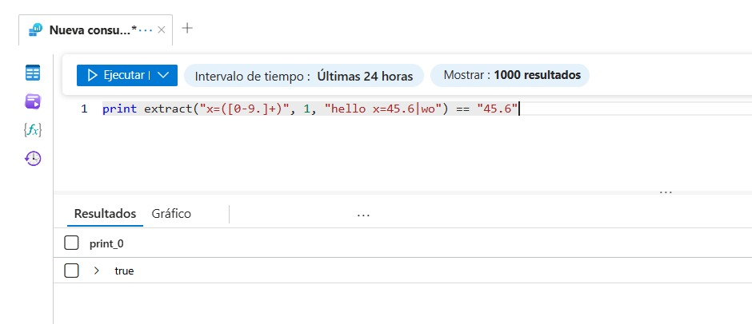
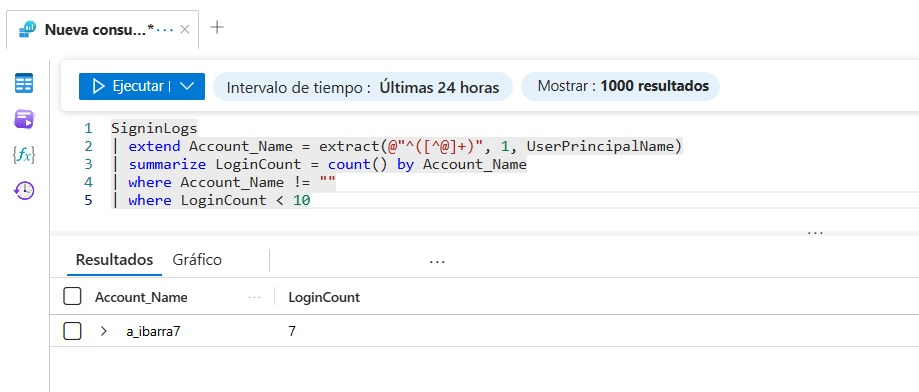
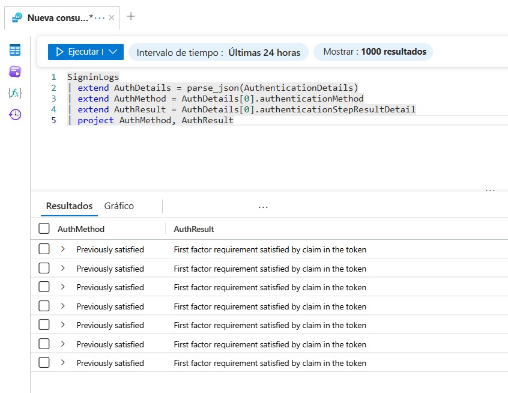
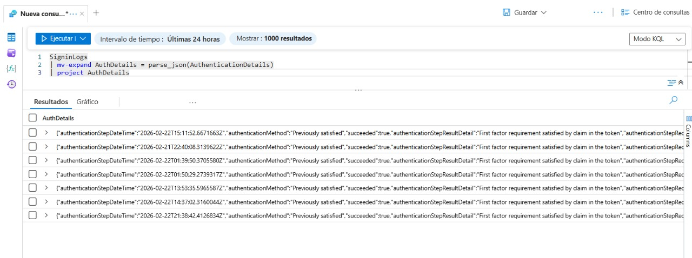

# Task 7 – Trabajo con Datos Tipo String en KQL

## Objetivo
Trabajar con campos estructurados y no estructurados utilizando funciones de manipulación de cadenas en KQL como:
- `extract()`
- `parse`
- `parse_json()`
- `mv-expand`
- `mv-apply`
- funciones personalizadas

---

## 7.1 Uso de la función extract()

La función `extract()` permite obtener un valor específico usando expresiones regulares.

### Ejemplo básico

```kql
print extract("x=([0-9.]+)", 1, "hello x=45.6|wo") == "45.6"
```

#### Explicación
- Se usa una expresión regular para capturar el valor después de "x=".
- El grupo 1 devuelve "45.6".
- El resultado es `true`.



---

## 7.2 Uso de extract() en SigninLogs

Extraer el nombre de usuario desde el campo UserPrincipalName.

```kql
SigninLogs
| extend Account_Name = extract(@"^([^@]+)", 1, UserPrincipalName)
| summarize LoginCount = count() by Account_Name
| where Account_Name != ""
| where LoginCount < 10
```

#### Explicación
- Se extrae la parte antes del símbolo "@".
- Se cuenta el número de inicios de sesión por usuario.
- Se filtran usuarios con menos de 10 accesos.



---

## 7.3 Uso del operador parse

El operador `parse` permite estructurar texto no estructurado.

```kql
let Traces = datatable(EventText:string)
[
    "Event: UserLogin (user=admin, ip=192.168.1.1, status=Success)",
    "Event: UserLogin (user=john, ip=192.168.1.2, status=Failed)"
];
Traces
| parse EventText with * "user=" user ", ip=" ip ", status=" status ")"
| project user, ip, status
```

#### Explicación
- Se crea una tabla temporal.
- Se extraen campos estructurados desde texto libre.
- Se convierten en columnas consultables.


---

## 7.4 Manipulación de JSON con parse_json()

Muchos logs almacenan datos en formato JSON.

```kql
SigninLogs
| extend AuthDetails = parse_json(AuthenticationDetails)
| extend AuthMethod = AuthDetails[0].authenticationMethod
| extend AuthResult = AuthDetails[0].authenticationStepResultDetail
| project AuthMethod, AuthResult
```

#### Explicación
- Se convierte el campo dinámico JSON en objeto consultable.
- Se extrae el método de autenticación.
- Se extrae el resultado del paso de autenticación.



---

## 7.5 Uso de mv-expand

Convierte arreglos dinámicos en múltiples filas.

```kql
SigninLogs
| mv-expand AuthDetails = parse_json(AuthenticationDetails)
| project AuthDetails
```

#### Explicación
- Cada elemento del arreglo JSON se convierte en una fila independiente.
- Permite análisis detallado de múltiples métodos de autenticación.



---

## 7.6 Uso de mv-apply

Permite aplicar una subconsulta a cada elemento de un arreglo.

```kql
SigninLogs
| mv-apply AuthDetails = parse_json(AuthenticationDetails) on
(
    where tostring(AuthDetails.authenticationMethod) == "Previously satisfied"
)
```

#### Explicación
- Filtra solo registros donde el método de autenticación fue contraseña.
- Permite análisis avanzado por elemento del arreglo.


---

## 7.7 Creación de una función en KQL

Se puede guardar una consulta como función reutilizable.

Ejemplo:

```kql
SigninLogs
| where ResultType != 0
```

Pasos para guardar:
1. Ejecutar la consulta.
2. Seleccionar **Save**.
3. Elegir **Save as Function**.
4. Asignar nombre: `FailedLogins`
5. Categoría: General.

Luego se puede usar escribiendo:

```kql
FailedLogins
```

---

## Conclusión

En este taller se practicó:
- Extracción de datos mediante expresiones regulares.
- Estructuración de texto no estructurado.
- Manipulación de datos JSON.
- Expansión de arreglos dinámicos.
- Creación de funciones reutilizables.

Estas técnicas son fundamentales para analizar registros complejos en Microsoft Sentinel y transformar datos en información útil para detección de amenazas.


